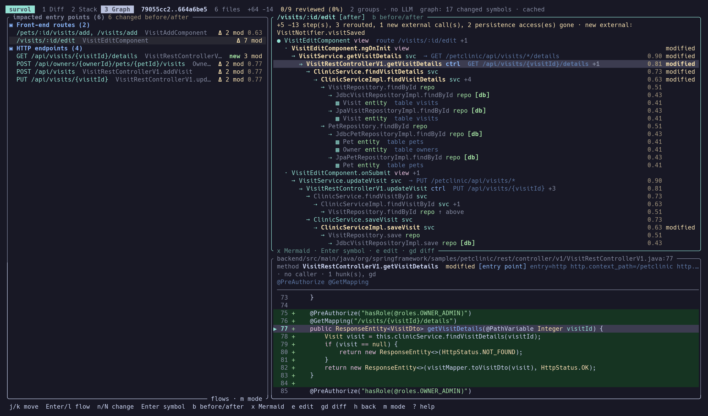
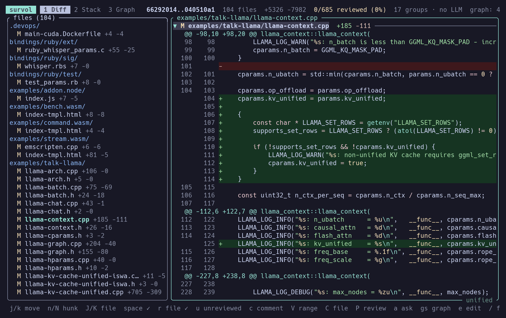
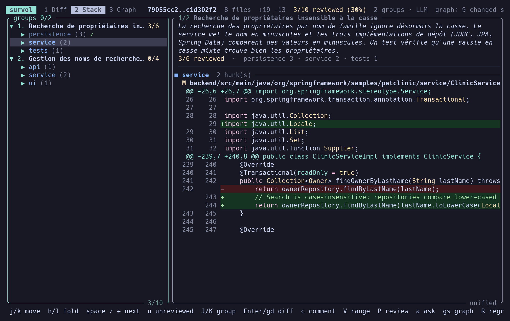
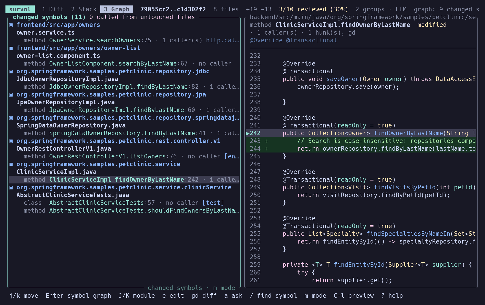
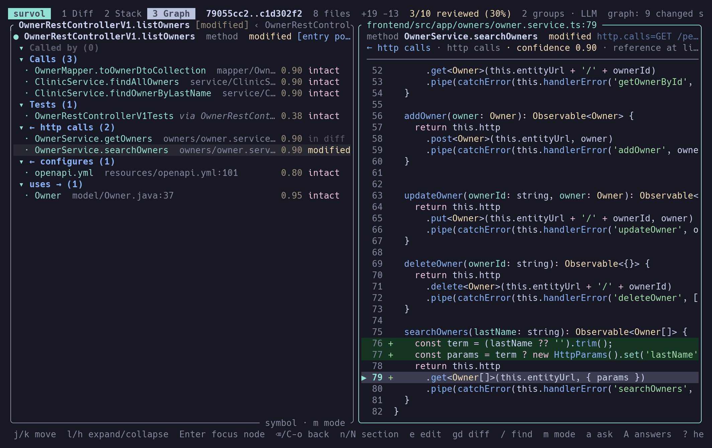
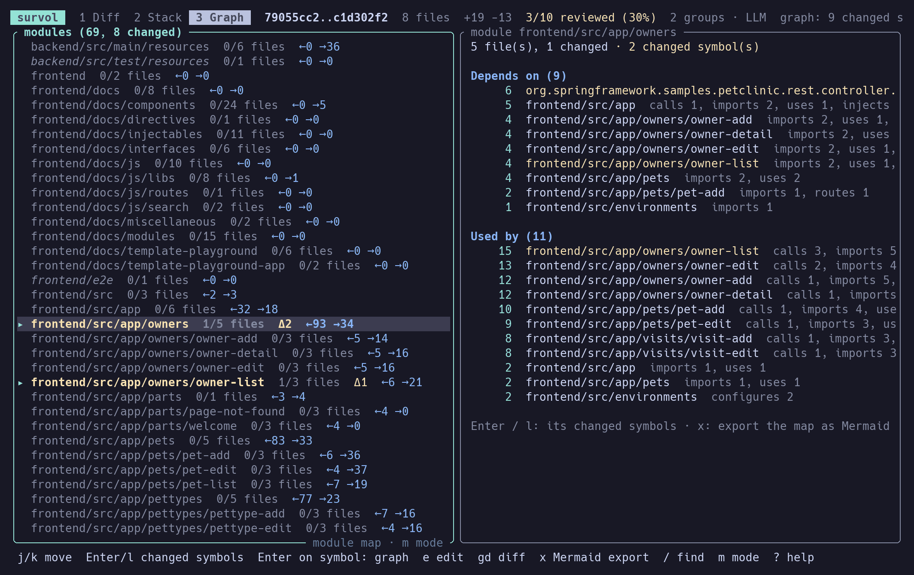
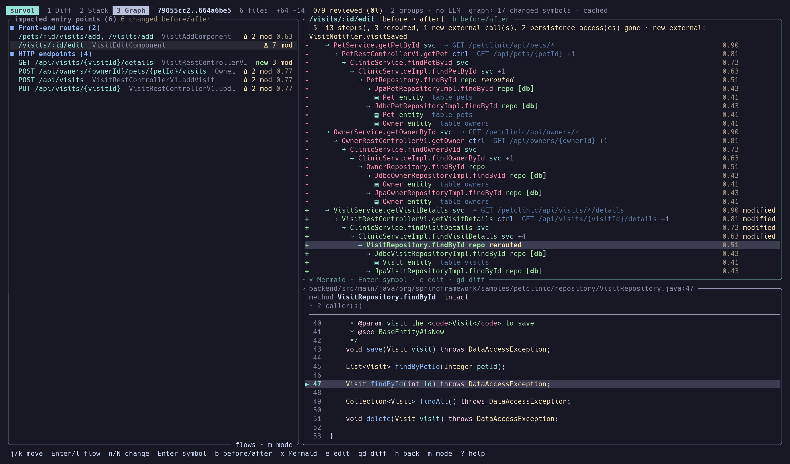
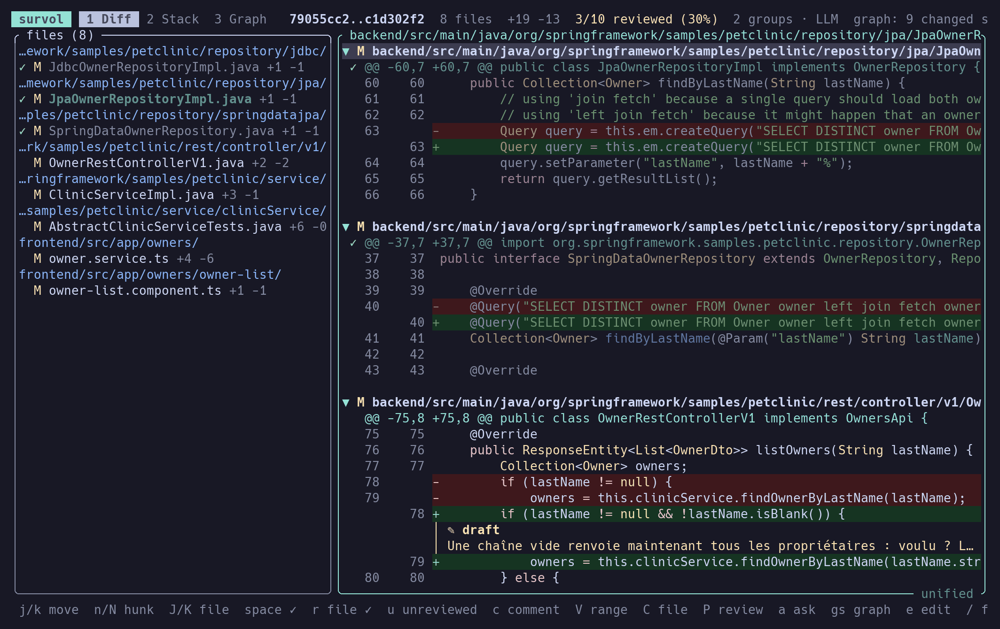
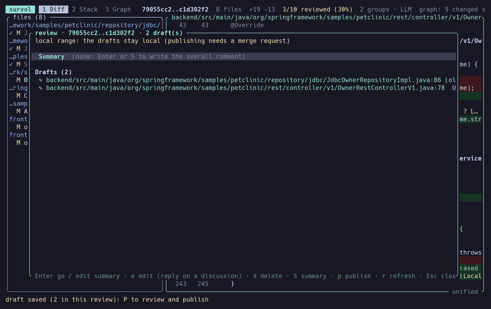

# survol

*A bird's-eye view of large pull requests.*



survol is a terminal UI for reviewing very large GitLab merge requests (hundreds of files,
often AI-generated). It helps you understand **how the whole change fits together**
(what calls what, how it is wired, what untouched code it affects) and form an
architectural opinion without reading every line. It is **not a bug finder**.

All links between pieces of code come from static analysis (tree-sitter, refined by
language servers). An LLM (the Claude Code CLI) is an optional thin layer: it names and
explains groups of hunks and answers questions about computed data.

See [HANDOFF.md](HANDOFF.md) (French) for the vision, the decisions and the roadmap.
Steps 0 to 6 are implemented.

## Contents

- [Features](#features)
  - [Diff view](#diff-view)
  - [Stack view](#stack-view)
  - [Graph view](#graph-view)
  - [Questions to the LLM](#questions-to-the-llm)
  - [Comments and publishing](#comments-and-publishing)
  - [Neovim](#neovim-integration)
- [Install](#install)
- [Quick start](#quick-start)
- [Configuration](#configuration)
- [Keybindings](#keybindings)
- [CLI reference](#cli-reference)
- [Neovim plugin](#neovim-plugin)
- [Privacy and safety](#privacy-and-safety)
- [GitLab notes](#gitlab-notes)
- [Limitations](#limitations)
- [Development](#development)
- [License](#license)

## Features

survol has three views sharing one review state. `Tab` / `Shift-Tab` (or `1` `2` `3`)
switches between them. "Reviewed" is keyed by hunk content: when new commits are pushed,
only the hunks that actually changed come back as unreviewed.

The MR head is fetched from `refs/merge-requests/<iid>/head` and checked out in a dedicated
worktree under `.git/survol/worktrees/`, so your working branch is never touched. The Diff
view is usable at once; the worktree, the grouping and the graph are built in the background.

### Diff view



Every file in one continuous stream, with a directory-ordered file tree, syntax
highlighting, unified or split (`s`) layout. Mark hunks (`space`) or files (`r`) as
reviewed, jump to the next unreviewed hunk (`u`), filter files (`/`), fold files.
`gs` jumps to the Graph view of the symbol under the cursor.

### Stack view



Hunks grouped by **functional capability**, then by **layer** (api, service, persistence,
tests…), each group with a title and a 2–3 line functional summary. Here the summaries
were generated in French (`--lang fr`).

- Grouping runs in the background at startup and is cached. Every hunk belongs to exactly
  one group (checked in code; invalid LLM answers are retried, then fall back to grouping
  by directory).
- Groups are ordered for reading: once the code graph is built, a topological sort puts
  the groups whose symbols others use first.
- A **mechanical** group (lockfiles, generated code, whitespace-only changes, pure renames,
  binaries) is detected without the LLM, placed last, folded, and validated with one `space`.
- `space` validates the whole node (group, layer or hunk) and moves on. `R` regroups
  without cache (asks first: it is a new LLM call). `w` shows grouping warnings.
- Without the LLM (`--no-llm`), groups are built by directory.

### Graph view

The code graph around the changes, built in the background (tree-sitter on git objects,
cached per blob) for **Java, Kotlin, TypeScript/TSX and JavaScript**, with framework rules
for **Spring** (endpoints, listeners, schedulers, beans and injection, Spring Data
repositories and entities, Feign / RestTemplate / WebClient, `application*.yml`,
events) and **Angular** (routes, components, templates, DI, `HttpClient` calls linked to
Spring endpoints). Every edge has a **confidence** (1.0 certain, lower when ambiguous).
`m` cycles through the modes below.

**Changed symbols**: changed symbols by module and file, with their callers and how many
live in files the diff does not touch (impact on untouched code).



**Symbol view** (`Enter` on a symbol, or `/` to find any symbol by name): a tree *Called
by / Calls / Tests*, then every other edge kind (`http calls`, `configures`, `uses`,
`injects`…). Each node shows its `file:line`, confidence and whether it is modified, in the
diff or intact. `l` / `h` expand / collapse (callers of callers…), `Enter` makes a node
the new root, `Backspace` / `Ctrl-o` goes back. The right pane previews the code.



**Module map**: packages / directories with their dependencies in and out (`←` / `→`
counts, `Δ` changed symbols). `Enter` lists a module's changed symbols, `x` writes the
map as Mermaid to `.git/survol/exports/`.



**Flows** (`f`): the entry points (HTTP endpoints, front-end routes, listeners, scheduled
jobs, runners) whose end-to-end flow reaches a changed symbol. `Enter` / `l` opens the flow:
an indented tree from the entry down to repositories (`[db]`, with their entities and
tables) and external calls, through calls, interface implementations, front → back HTTP
calls and events, each step with its layer, modified state and path confidence (see the
screenshot at the top). `n` / `N` jump between changed steps.

The base revision's graph is built in the background. When a flow differs, `b` cycles
**after → before → merged**: added (`+`) and removed (`-`) steps, reroutes, new external
calls, persistence accesses gone. `x` writes the flow (or its before / after) as Mermaid.



**Language servers** (optional): once the graph and the worktree are ready, survol starts
the installed servers (jdtls, kotlin-language-server or kotlin-lsp,
typescript-language-server or `tsc --lsp`) and checks the call edges around the changed
methods: confirmed edges go to confidence 1, wrong guesses are removed, missed callers
added. The header shows `⟳ LSP: refining 12/40`, then `LSP ✓n` (the graph is swapped in
place) or `LSP ✗` (the heuristic graph stays). Bounded by `[lsp] budget_secs`, cached per
head commit.

### Questions to the LLM

![An answer about a Spring endpoint, citing code as navigable [path:line] links (French output)](docs/screenshots/llm-answer.png)

`a` asks about the node under the cursor: a symbol (Graph), a group or the hunk under the
cursor (Stack), a hunk (Diff). Pick a suggested question (`↑` / `↓` or its number) or
type one; it runs in the background (`Esc` to keep reviewing).

The answer only uses what survol computed: the node's code, its callers / callees / tests
with `file:line` and confidence, the group summary, the hunks, `.survol/instructions.md`.
It cites code as `[path:line]`: `Tab` / `n` selects the next link, `Enter` opens the
Graph view of the symbol there (or the line in the Diff view), `d` the Diff view, `e` the
editor. References to lines the model was not given are struck out and not navigable.
`A` reopens the last answer, then the review's question history. Answers are cached.

### Comments and publishing



In the Diff and Stack views, `c` comments the line under the cursor (on a draft: edits it;
on a GitLab discussion: replies to it), `V` then `c` a range of lines within one hunk, `C`
the whole file. Drafts are local and follow their line when new commits arrive (a draft
whose line is gone is marked *stale* and never published). For a merge request, the
existing discussions are fetched in the background and shown under their line, with author
and resolved state.



`P` opens the **Review panel**: the overall comment (`S`), the drafts (`Enter` go, `e`
edit, `d` delete), the discussions (`e` reply) and `p` publish. Publishing shows what will
be sent (`J` for the exact JSON requests) and waits for `y`. It creates GitLab draft notes,
then publishes them all at once (`bulk_publish`), so the review appears in one go. A local
range (`base..head`) keeps its drafts local.

### Neovim integration

survol.nvim runs survol in a persistent floating terminal, like lazygit.nvim. `e` in the
TUI hides the float and opens the file at the line in the parent Neovim, with your LSP and
keymaps; `:SurvolBack` shows the same TUI where you left it. See [Neovim plugin](#neovim-plugin).

## Install

### Prerequisites

| Tool | Needed for | Notes |
|---|---|---|
| Rust toolchain | building | Pinned by `rust-toolchain.toml` (1.98.1, installed by rustup on first build); MSRV 1.90, edition 2024 |
| `git` | everything | survol shells out to the `git` binary (your credentials, SSH, `refs/merge-requests/*`) |
| `glab` | optional | GitLab token source (`glab auth login --hostname <host>`); or set `GITLAB_TOKEN` |
| Claude Code CLI (`claude`) | optional | Grouping and questions; logged in. Without it, use `--no-llm` |
| Neovim ≥ 0.10 | optional | The plugin; otherwise files open in `$VISUAL` / `$EDITOR` |
| `jdtls` | optional, Java | `brew install jdtls` |
| `kotlin-language-server` | optional, Kotlin | `brew install kotlin-language-server`. Fails on JDK 25: point it to a JDK 21 via `[lsp.kotlin] env`. Fallback: JetBrains `kotlin-lsp` (`brew install --cask kotlin-lsp`) |
| `typescript-language-server` | optional, TS/JS | `npm i -g typescript-language-server typescript`. Fallback: TypeScript ≥ 7's `tsc --lsp --stdio` |

### Build

```sh
git clone https://github.com/bfernandez31/survol && cd survol
cargo install --path crates/survol-tui   # the `survol` binary (TUI)
cargo install --path crates/survol-cli   # `survol-cli` (JSON engine, doctor)
```

## Quick start

1. Configure your GitLab host in `~/.config/survol/config.toml` (see
   [Configuration](#configuration)), or export `GITLAB_HOST`:

   ```toml
   [gitlab]
   host = "gitlab.corp.example"
   ```

2. Check the setup (git, repository, GitLab host / CA / token / API version, glab, nvim,
   the LLM CLI and its account, the language servers):

   ```sh
   survol-cli doctor
   ```

3. Open a review from the repository:

   ```sh
   survol                 # MR of the current branch
   survol 123             # MR !123 of this repo's project (also `!123`)
   survol https://gitlab.corp.example/group/app/-/merge_requests/123
   survol main..feat      # local range, diffed from the merge base (no GitLab needed)
   survol --no-llm 123    # never call the LLM: the Stack view groups by directory
   survol --lang fr 123   # LLM titles, summaries and answers in French
   survol --no-lsp 123    # heuristic graph only: start no language server
   survol -C ~/src/app 123
   ```

4. Cheat-sheet (`?` shows the keys of the current view):

   | Key | Action |
   |---|---|
   | `Tab` / `1` `2` `3` | Diff / Stack / Graph |
   | `j` `k`, `n` `N`, `J` `K` | move, next hunk, next file / group |
   | `space`, `u` | mark reviewed and go on, next unreviewed |
   | `gs`, `gd`, `e` | Graph view of the symbol, back to the Diff, open in editor |
   | `m`, `f` | Graph mode, flows |
   | `a`, `A` | ask the LLM, previous answers |
   | `c`, `V` `c`, `C`, `P` | comment line / range / file, Review panel |
   | `?`, `q` | help, quit |

## Configuration

survol reads `~/.config/survol/config.toml` (or `$XDG_CONFIG_HOME/survol/config.toml`),
then the project's `.survol/config.toml` (merged key by key on top), then environment
variables. Unknown keys are rejected. `survol-cli config` prints the effective
configuration and the files it was read from.

### Full reference

```toml
[gitlab]
host = "gitlab.corp.example"      # required for merge requests (or GITLAB_HOST); https:// optional
# ca_cert = "/path/to/corp-ca.pem"  # extra PEM trusted on top of the system store (or SURVOL_CA_CERT)

[git]
remote = "origin"                  # remote to fetch refs/merge-requests/* from

[review]
mechanical_globs = []              # extra globs for the mechanical group, on top of the built-in
                                   # ones (lockfiles, wrappers, *.min.*, *.map, generated/...)
# mechanical_globs = ["**/openapi/generated/**"]

[llm]
enabled = true                     # false: never call the LLM (same as --no-llm)
command = "claude"                 # the Claude Code CLI
# group_model = "sonnet"           # model for grouping (default: the CLI's default)
group_effort = "low"               # reasoning effort for grouping: low (fast), medium, high...
# ask_model = "opus"               # model for questions (default: the CLI's default)
# config_dir = "~/.claude-work"    # CLAUDE_CONFIG_DIR for the CLI: use another Claude account
max_prompt_chars = 150000          # bigger reviews are grouped directory by directory, then merged
language = "English"               # LLM-written text: a name or a code (fr, de, es, it, pt, nl...);
                                   # --lang overrides it

[lsp]                              # language servers refining the code graph
enabled = true                     # false: heuristic graph only (same as --no-lsp)
budget_secs = 60                   # hard limit for a whole refinement, server start included
request_timeout_secs = 10          # limit of one request

[lsp.java]                         # default: jdtls -data {data}
enabled = true
# command = "jdtls"                # looked up in PATH, ~ expanded
# args = ["-data", "{data}"]       # {data}: a per-workspace directory under .git/survol/lsp/
# env = {}

[lsp.kotlin]                       # default: kotlin-language-server, else kotlin-lsp --stdio --system-path {data}
enabled = true
# env = { JAVA_HOME = "/opt/homebrew/opt/openjdk@21/libexec/openjdk.jdk/Contents/Home" }
#                                  # kotlin-language-server fails on JDK 25: give it a JDK 21

[lsp.typescript]                   # TS and JS. default: typescript-language-server --stdio,
enabled = true                     # else TypeScript >= 7's `tsc --lsp --stdio`
```

Every `[lsp.<language>]` section takes the same four keys: `enabled`, `command`, `args`,
`env`. Without `command`, the built-in candidates are tried in order.

### Environment variables

| Variable | Effect |
|---|---|
| `GITLAB_HOST` | Overrides `[gitlab] host` |
| `GITLAB_TOKEN` | GitLab token. Otherwise `glab config get token --host <host>` is used |
| `SURVOL_CA_CERT` | Overrides `[gitlab] ca_cert` |
| `SURVOL_LLM_LOG=<dir>` | Keeps every prompt and raw LLM answer in `<dir>` (debugging cost / latency) |
| `XDG_CONFIG_HOME` | Location of the user config (`$XDG_CONFIG_HOME/survol/config.toml`) |
| `NVIM` | Set by Neovim's terminal: `e` opens files in that parent Neovim |
| `VISUAL` / `EDITOR` | Editor used outside Neovim (default `nvim`), run as `<editor> +<line> <file>` |

### Project files

| File | Purpose |
|---|---|
| `.survol/config.toml` | Per-project overrides (e.g. extra `mechanical_globs`, a JDK for Kotlin) |
| `.survol/instructions.md` | Your team's architecture conventions, added to the grouping and question prompts |

### Where data lives

Everything is stored under the repository's `.git/survol/`, never in the working tree:

| Path | Content |
|---|---|
| `worktrees/` | One worktree per reviewed head |
| `reviews/<key>/state.json` | Reviewed hunks and files |
| `reviews/<key>/comments.json` | Draft comments and the overall comment |
| `reviews/<key>/questions.json` | Question history |
| `cache/<head>/groups.json` | Stack grouping |
| `cache/<head>/graph.json`, `graph-lsp.json`, `base-graph.json` | Code graph, LSP-refined graph, base revision graph |
| `cache/<head>/ask/` | Cached answers |
| `cache/index/` | tree-sitter index, per blob |
| `lsp/` | Language server workspaces (`{data}`) |
| `exports/` | Mermaid exports |

## Keybindings

Press `?` in any view for the keys of that view. Tables below come from the in-app help.

### All views

| Key | Action |
|---|---|
| `Tab` / `Shift-Tab`, `1` `2` `3` | next / previous view, Diff / Stack / Graph |
| `Ctrl-h` / `Ctrl-l` | focus list / content pane |
| `B` | show / hide the list pane |
| `j` / `k`, `Ctrl-d` / `Ctrl-u` | move, half page down / up |
| `gg` / `G` | top / bottom |
| `h` / `l`, `0` | scroll content horizontally, reset |
| `s` | unified ↔ split |
| `e` | open in editor (parent Neovim if any) |
| `a` | ask the LLM about the node / group / hunk |
| `A` | last answer, then the review's questions |
| `P` | Review panel: drafts, summary, discussions, publish |
| `?` | keys of the current view |
| `q` | quit (state is saved on each change) |

### Diff

| Key | Action |
|---|---|
| `n` / `N` (`{` `}`) | next / previous hunk |
| `J` / `K` (`[` `]`) | next / previous file |
| `u` | next unreviewed hunk |
| `space` | toggle hunk reviewed, go to next |
| `r` / `v` | toggle file reviewed (folds it) |
| `o` / `za`, `Enter` on header | fold / unfold file |
| `zM` / `zR` | fold / unfold all |
| `/` | filter files, `Esc` to clear |
| `gs` | Graph view of the symbol under the cursor |
| `c` | comment the line (on a draft: edit; on a thread: reply) |
| `V` then `c` | select lines, comment the range |
| `C` | comment the whole file |

### Stack

| Key | Action |
|---|---|
| `space` | toggle group / layer / hunk reviewed, go on |
| `u` | next unreviewed group |
| `J` / `K` (`[` `]`) | next / previous group |
| `h` / `l` (list) | fold / unfold, parent / child |
| `o` / `za`, `zM` / `zR` | fold / unfold node, all |
| `Enter` / `gd` | show the hunk in the Diff view |
| `n` / `N` (content) | next / previous hunk |
| `w` | grouping warnings |
| `R` | regroup without cache (asks: LLM call) |
| `gs` | Graph view of the hunk's symbol |
| `c` / `V` then `c` / `C` (content) | comment line / range / file |

### Graph

| Key | Action |
|---|---|
| `m` | mode: changed symbols / search / module map / flows / symbol |
| `Enter` | symbol: focus it (new root); section / module: fold |
| `l` / `h` | expand / collapse (callers of callers…), parent |
| `Backspace` / `Ctrl-o` | back to the previous symbol or list |
| `n` / `N` (`J` / `K`) | next / previous section or module |
| `/` | find a symbol by name (changed or not) |
| `e` | open the node's line in the editor |
| `gd` | the symbol's hunks in the Diff view |
| `Ctrl-l`, `j` / `k` | preview pane, scroll it |
| `x` | write the module map as Mermaid (`.git/survol/exports`) |
| `f` | flows: impacted entry points and their end-to-end flow |
| flows: `Enter` / `l`, `h` | into the flow, back to the entry points |
| flows: `n` / `N` | next / previous changed (or added / removed) step |
| flows: `Enter` | symbol view of the step |
| flows: `b` | after → before → merged (when the flow differs) |
| flows: `x` | write the flow as Mermaid (`.git/survol/exports`) |

### Popups

| Where | Keys |
|---|---|
| Question input | type, or `↑` / `↓` (`Tab`, `Ctrl-n` / `Ctrl-p`) or `1`–`9` to pick a suggestion; `Ctrl-u` clear; `Enter` ask; `Esc` cancel |
| Answer | `Tab` / `n`, `Shift-Tab` / `N` next / previous link; `Enter` go (Graph, else Diff); `d` Diff; `e` editor; `j` / `k`, `Ctrl-d` / `Ctrl-u` scroll; `A` history; `Esc` / `q` close |
| Comment editor | `Ctrl-s` or `Alt-Enter` save; `Enter` new line; `Tab` indent; `Ctrl-u` clear the line; `Esc` cancel (twice if the text changed) |
| Review panel | `Enter` go / edit summary; `e` edit (reply on a discussion); `d` delete; `S` summary; `p` publish; `r` refresh; `Esc` / `P` close |
| Publish confirmation | `y` publish; `n` cancel; `J` exact JSON requests; `j` / `k` scroll |

## CLI reference

### `survol`

```
survol [OPTIONS] [TARGET]
  TARGET        MR number (123, !123), MR URL, or local range base..head.
                Empty: the MR of the current branch
  -C, --repo    repository to work in (default: current directory)
  --no-llm      never call the LLM (same as [llm] enabled = false)
  --lang LANG   language of LLM-written text (overrides [llm] language)
  --no-lsp      do not start language servers (same as [lsp] enabled = false)
```

### `survol-cli`

The engine as JSON commands, for scripts, tests and debugging. Every command takes
`-C, --repo` and the same `TARGET` as `survol`.

| Command | What it does | Options |
|---|---|---|
| `doctor` | Checks git, GitLab access, nvim, the LLM CLI, the language servers | `--json` |
| `config` | Prints the effective configuration and where it is read from | |
| `fetch` | Fetches a merge request and checks it out in its worktree | |
| `diff` | Parsed diff (files, hunks) as JSON | |
| `group` | Stack grouping as JSON | `--no-cache`, `--no-llm`, `--lang` |
| `graph` | Changed symbols with callers, callees, tests as JSON | `--symbol NAME`, `--modules`, `--mermaid`, `--no-cache`, `--lsp` (refine and print edge counts by confidence before / after on stderr) |
| `flows` | Impacted entry points and their end-to-end flows, with before / after | `--entry NAME`, `--mermaid`, `--no-base`, `--no-cache` |
| `ask` | Asks a question about a symbol, a group or a hunk | `--symbol NAME`, `--group N` (1 = first), `--hunk ID`, `--no-cache`, `--prompt` (print the prompt, no LLM call), `--lang` |
| `comments` | Local drafts (and where they land) and the MR's discussions | |
| `publish` | Publishes the drafts to the MR | `--dry-run` (print the exact requests), `--yes` (required to send) |

Examples (with [jq](https://jqlang.org)):

```sh
survol-cli doctor
survol-cli diff main..HEAD | jq '.files | length'
survol-cli group main..HEAD | jq '.groups[] | {title, hunks: (.hunk_ids | length)}'
survol-cli graph main..HEAD | jq '.symbols[] | {name, callers: [.callers[] | .name]}'
survol-cli graph main..HEAD --symbol OwnerService.find    # one symbol, changed or not
survol-cli graph main..HEAD --modules                     # package / directory dependencies
survol-cli graph main..HEAD --mermaid                     # the module map as a Mermaid flowchart
survol-cli graph main..HEAD --lsp > /dev/null             # LSP refinement stats on stderr
survol-cli flows main..HEAD | jq '.flows[] | {label: .entry.label, diff: .diff.status}'
survol-cli flows main..HEAD --entry "GET /api/owners" --mermaid   # one flow, before / after
survol-cli ask main..HEAD --symbol Owner.addPet "What does this component do?"
survol-cli ask main..HEAD --group 2 --prompt "How do the pieces fit together?"   # no LLM call
survol-cli comments 123            # drafts + the MR's discussions
survol-cli publish 123 --dry-run   # the exact API requests, nothing sent
survol-cli publish 123 --yes       # publish the drafts
```

## Neovim plugin

survol.nvim (Neovim ≥ 0.10) lives in [`nvim/`](nvim). Commands work without `setup()`;
`setup()` only sets options and the toggle key.

```lua
-- lazy.nvim
{
  dir = "path/to/survol/nvim",
  cmd = { "Survol", "SurvolToggle" },
  keys = { { "<leader>sv", "<cmd>SurvolToggle<cr>", desc = "survol" } },
  opts = {
    cmd = "survol",        -- survol binary
    args = {},             -- always passed before the target, e.g. { "--no-llm" }
    width = 0.95,          -- fraction of the editor (<= 1) or cells
    height = 0.92,
    border = "rounded",
    open_mode = "edit",    -- where files open: "edit" (the window survol was opened from), "tab", "split", "vsplit"
    toggle_key = nil,      -- e.g. "<C-g>": toggles in normal mode, hides the float from inside the TUI
  },
}
```

| Command | |
|---|---|
| `:Survol [mr\|url\|base..head] [--no-llm] [--lang fr]` | Shows the running review, or starts one (a different target restarts it). Completes flags, `--lang` values and branches. |
| `:SurvolToggle` | Hides / shows the float; survol keeps running |
| `:SurvolBack` | Back to the review, where you left it |
| `:SurvolClose` | Stops survol |
| `:checkhealth survol` | Neovim version, binary and version, RPC socket |

**Round trip.** `e` in the TUI calls `require("survol").open_file(path, line, col)` in the
parent Neovim through `nvim --server $NVIM --remote-expr`. The float is hidden, not
closed, and the file opens at the line (an existing window already showing it is reused).
`:SurvolBack` or your toggle key shows the same TUI at the same position. Without the
plugin loaded, survol falls back to `:tabedit +line`. Outside Neovim, `e` suspends the TUI
and runs `$VISUAL` / `$EDITOR`.

## Privacy and safety

- **LLM**: code is sent only through the Claude Code CLI, only when the LLM is enabled, and
  only for grouping (a compressed line per hunk) and for questions you ask (the node's
  context). The CLI runs as a pure one-turn completion: no tools, MCP servers, skills or
  user settings (`--tools "" --strict-mcp-config --disable-slash-commands
  --no-session-persistence --setting-sources ""`). survol stores no API key.
- **No LLM at all**: `--no-llm` or `[llm] enabled = false`. The Stack view then groups by
  directory; `a` is disabled. Diff, graph, flows and comments work fully offline.
- **Which account**: `[llm] config_dir` sets `CLAUDE_CONFIG_DIR` for the CLI. Put it in the
  project's `.survol/config.toml` to route work code to a work account without touching
  your default one; `survol-cli doctor` shows the account in use.
- **No telemetry.** survol itself only talks to your GitLab host (API, `git fetch`); the LLM CLI does its own network calls when enabled.
- **GitLab writes need confirmation**: `y` in the TUI after the full list of requests,
  `--yes` on the command line. `publish --dry-run` prints the exact requests and sends
  nothing. Local ranges are never published.
- **Warning**: `bulk_publish` publishes *all* your pending draft notes on the MR, including
  drafts you started in the browser. The confirmation shows how many are already there.
- Stale drafts (their line is gone) are never sent. An interrupted publication resumes
  without duplicates.

## GitLab notes

- Self-hosted instances only need `host`; no gitlab.com URL is hard-coded.
- TLS uses the platform verifier: a corporate CA installed in the system keychain works as
  is. Otherwise, add a PEM with `ca_cert` / `SURVOL_CA_CERT`.
- Token: `GITLAB_TOKEN`, else `glab config get token --host <host>`.
- Version-dependent features (read from `GET /version`):

  | Feature | GitLab version | Otherwise |
  |---|---|---|
  | Draft notes + `bulk_publish` | ≥ 15.10 | Comments posted one by one as discussions (with a warning: each notifies at once) |
  | File comments (`position_type: file`) | ≥ 16.4 | General comment prefixed with the file path |

- **To validate on a real instance**: these thresholds, and that GitLab accepts the computed
  positions, especially multi-line ranges (`line_range`) and file comments. Positions were
  tested against a fake GitLab server, not yet against a production instance.

## Limitations

- **Languages**: Java, Kotlin, TypeScript/TSX, JavaScript. Other files appear in the Diff
  and Stack views but not in the graph.
- **Spring rules**: collection injection (`List<T>`, `ObjectProvider<T>`) not resolved,
  `@Profile` / `@Conditional*` ignored (all implementations count), WebFlux functional
  routes not read, Spring Data inherited methods (`findById` not declared) have no edge.
- **Angular rules**: attribute selectors (`[appX]`) ignored; URLs built in another method or
  passed as a parameter become wildcards (weaker or no link); `HttpClient.request(...)` not read.
- **Heuristic graph**: same-arity overloads and types inferred from a call stay uncertain
  without a language server; calls from `describe` / `it` callbacks are attached to the file.
- **LSP**: only `calls` / `tests` edges around changed callables are checked (interface
  dispatch, injections, HTTP links unchanged); method references (`Foo::bar`) often stay
  uncertain; jdtls or a first Gradle import may exceed the default budget on the first run
  (faster afterwards); kotlin-lsp may be blocked by macOS security on some machines.
- **Flows**: HTTP links below 0.5 are treated as external calls; the before / after merge is
  aligned by id (a repeated step is not expanded again); the base graph is complete up to
  5,000 files, otherwise limited to the neighbourhood of the flows.
- **Editor**: only the line (not the column) is passed from the views.
- **GitHub** is not supported (the forge abstraction is ready for it).
- Grouping and publishing still need validation on a large real GitLab MR.

## Development

```sh
cargo fmt --all --check
cargo clippy --workspace --all-targets -- -D warnings
cargo test --workspace
nvim --headless -u NONE -i NONE -c "luafile nvim/tests/survol_spec.lua"   # survol.nvim tests
```

CI ([`.github/workflows/ci.yml`](.github/workflows/ci.yml)) runs fmt, clippy and tests with
`RUSTFLAGS=-D warnings` on the pinned toolchain, and the Neovim headless tests on
Neovim 0.11.4.

Layout: `crates/survol-core` (engine: forge, git, diff, index, graph, flows, LSP client,
LLM, comments), `crates/survol-cli` (JSON commands), `crates/survol-tui` (ratatui UI),
`nvim/` (plugin). tree-sitter queries live in `crates/survol-core/queries/`, LLM prompts
in `crates/survol-core/prompts/`. Design decisions and status: [HANDOFF.md](HANDOFF.md).

## License

MIT (see `license` in [Cargo.toml](Cargo.toml)).
